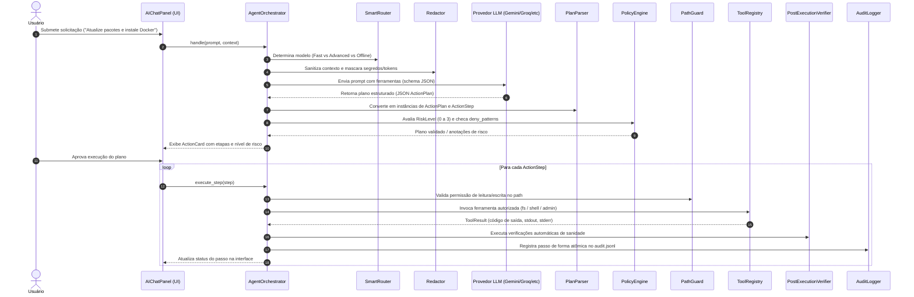

# 🏛️ OnyxSH — Arquitetura de Software e Guia Técnico do Sistema

> **Documento de Referência Primária para Agentes de IA e Engenheiros de Software**  
> **Identificador do Aplicativo (App ID):** `io.github.vagnarok.OnyxSH`  
> **Versão Corrente:** `0.13.0`  
> **Licença:** GNU General Public License v3.0 or later (GPL-3.0-or-later)  
> **Repositório:** [VaGNaroK/OnyxSH](https://github.com/VaGNaroK/OnyxSH)  
> **Stack Base:** Python 3.10+ (otimizado para 3.12+), GTK4 (4.12+), Libadwaita (Adw 1), VTE 3.91+ (`vte-2.91-gtk4`), PyGObject, Pycairo, host-spawn (1.6.2), psutil, pycryptodomex, Pygments.

---

## 📑 Sumário Executivo

1. [Visão Geral e Filosofia do Projeto](#1-visão-geral-e-filosofia-do-projeto)
2. [Diagrama Arquitetural de Alto Nível](#2-diagrama-arquitetural-de-alto-nível)
3. [Mapeamento Estrutural do Repositório](#3-mapeamento-estrutural-do-repositório)
4. [Subsistemas Centrais](#4-subsistemas-centrais)
   - [4.1. Core, Ciclo de Vida e Inicialização](#41-core-ciclo-de-vida-e-inicialização)
   - [4.2. Terminal Engine, PTY e Sandbox Escape](#42-terminal-engine-pty-e-sandbox-escape)
   - [4.3. Inteligência Artificial: Chat Assistant & Agent Mode Zero-Trust](#43-inteligência-artificial-chat-assistant--agent-mode-zero-trust)
   - [4.4. Gerenciador de Arquivos Dual-Pane & Transferências](#44-gerenciador-de-arquivos-dual-pane--transferências)
   - [4.5. Gerenciamento de Sessões SSH e Credenciais](#45-gerenciamento-de-sessões-ssh-e-credenciais)
   - [4.6. Configurações Reativas e Temas Libadwaita](#46-configurações-reativas-e-temas-libadwaita)
   - [4.7. Elevação Administrativa Segura (Polkit Helper)](#47-elevação-administrativa-segura-polkit-helper)
   - [4.8. Métricas do Sistema e Observabilidade](#48-métricas-do-sistema-e-observabilidade)
5. [Padrões de Projeto e Práticas Concorrentes](#5-padrões-de-projeto-e-práticas-concorrentes)
6. [Diretrizes de Segurança para Agentes de IA](#6-diretrizes-de-segurança-para-agentes-de-ia)
7. [Guia de Desenvolvimento e Testes Automatizados](#7-guia-de-desenvolvimento-e-testes-automatizados)

---

## 1. Visão Geral e Filosofia do Projeto

O **OnyxSH** é um emulador de terminal moderno, seguro e multifuncional para o ambiente de desktop Linux/GNOME. Construído com tecnologias de ponta do ecossistema GNOME (**GTK4** e **Libadwaita**), ele unifica:

- **Emulação de Terminal de Alta Performance:** Widget VTE com realce sintático léxico em tempo real, suporte completo a sequências semânticas OSC 133 e rastreamento de diretório OSC 7.
- **Isolamento e Compatibilidade Flatpak:** Capacidade de rodar confinado em sandbox Flatpak sem perder acesso ao sistema host, operando via `host-spawn` com alocação real de PTY e repasse de sinais POSIX.
- **Inteligência Artificial Integrada:** Assistente de terminal contextual e motor de Agente Autônomo com arquitetura **Zero-Trust**, classificação de risco (níveis 0 a 3), sanitização de dados sensíveis (Redactor), políticas estritas de filesystem (`PathGuard`) e auditoria atômica com rollback.
- **Administração de Infraestrutura:** Gestão em árvore de servidores SSH, túneis (L/R/D), monitor de integridade de conexões SSH em tempo real, servidor TFTP embutido e gerenciador de arquivos dual-pane (Local/SFTP) com visualizador rápido (*Quick Look*).

---

## 2. Diagrama Arquitetural de Alto Nível

```mermaid
graph TD
    subgraph UI ["Camada de Interface Gráfica (GTK4 + Libadwaita)"]
        Window["CommTerminalWindow (window.py)"]
        TabBar["Custom Tab Bar & Splits (tabs.py)"]
        TerminalView["Vte.Terminal + HighlightedProxy"]
        AIChatPanel["AIChatPanel & Histórico (ai_chat_panel.py)"]
        FileManagerView["DualPane / LocalPane (manager.py)"]
        SessionTree["SessionTreeView (tree.py)"]
        ResourceDash["ResourceDashboard & Sparklines (Cairo)"]
    end

    subgraph Controllers ["Controladores e Estado da Aplicação"]
        App["CommTerminalApp (app.py)"]
        TermMgr["TerminalManager (manager.py)"]
        AIAssistant["TerminalAiAssistant (ai_assistant.py)"]
        SettingsMgr["SettingsManager (settings/manager.py)"]
        ThemeEng["ThemeEngine (utils/theme_engine.py)"]
        TaskMgr["AsyncTaskManager (core/tasks.py)"]
    end

    subgraph TerminalSubsystem ["Subsistema de Terminal"]
        Spawner["TerminalSpawner & ProcessTracker (spawner.py)"]
        SemTracker["SemanticTracker - OSC 133 (semantic_tracker.py)"]
        ProdGuard["ProductionGuard (production_guard.py)"]
        SyntaxEng["_highlighter_impl & Pygments"]
        SSHMonitor["SSHHealthMonitor (ssh_health_monitor.py)"]
        TunnelMgr["SSHTunnelManager (tunnel_manager.py)"]
    end

    subgraph AgentSubsystem ["Subsistema do Agente de IA (Zero-Trust)"]
        Router["SmartRouter & ComplexityClassifier (router.py)"]
        Orchestrator["AgentOrchestrator (orchestrator.py)"]
        Planner["PlanParser & ActionPlan (planner.py)"]
        Policy["PolicyEngine & Deny Patterns (policy_engine.py)"]
        PathG["PathGuard & Sandboxing (path_guard.py)"]
        Redact["Redactor - Mascaramento de Secrets (redactor.py)"]
        Verifier["PostExecutionVerifier (verifier.py)"]
        ErrMatcher["ErrorMatcher - Quick Fixes (error_matcher.py)"]
        Audit["AuditLogger & Atomic Rollback (audit.py)"]
        Providers["Provedores: Gemini, Groq, Ollama, OpenRouter"]
    end

    subgraph SystemHost ["Host Linux & Infraestrutura de Baixo Nível"]
        HostSpawn["host-spawn / flatpak-spawn --host"]
        PTY["Linux PTY Subsystem (/dev/pts)"]
        Polkit["OnyxSH Admin Helper (pkexec / Polkit)"]
        Keyring["SecretService (GNOME Keyring)"]
        Psutil["psutil (Métricas de Sistema)"]
    end

    %% Conexões UI -> Controllers
    Window --> TermMgr
    Window --> AIChatPanel
    Window --> FileManagerView
    Window --> SessionTree
    Window --> ResourceDash
    App --> Window
    App --> SettingsMgr

    %% Conexões Terminal
    TermMgr --> Spawner
    TermMgr --> SemTracker
    TermMgr --> ProdGuard
    TermMgr --> SyntaxEng
    TermMgr --> SSHMonitor
    TermMgr --> TunnelMgr
    Spawner --> HostSpawn
    Spawner --> PTY

    %% Conexões IA
    AIChatPanel --> AIAssistant
    AIChatPanel --> Orchestrator
    AIAssistant --> Router
    Orchestrator --> Router
    Orchestrator --> Planner
    Orchestrator --> Policy
    Orchestrator --> PathG
    Orchestrator --> Redact
    Orchestrator --> Verifier
    Orchestrator --> Audit
    Router --> Providers

    %% Conexões Utilitárias
    TermMgr --> ErrMatcher
    TaskMgr --> Psutil
    Window --> Polkit
```



---

## 3. Mapeamento Estrutural do Repositório

O projeto adota layout padronizado `src/` em conformidade com o ecossistema moderno do Python (PEP 518/621):

```
OnyxSH/
├── src/onyxsh/                     # Pacote Python principal da aplicação
│   ├── __init__.py                 # Ponto de entrada de inicialização do pacote
│   ├── app.py                      # Subclasse Adw.Application (ciclo de vida, CLI, IPC)
│   ├── window.py                   # Janela principal Adw.ApplicationWindow
│   ├── helpers.py                  # Funções auxiliares gerais (URL parsing, etc.)
│   │
│   ├── admin/                      # Elevação de privilégios via Polkit
│   │   ├── helper.py               # Processo isolado executado com privilégios de root
│   │   └── io.github.vagnarok.OnyxSH.policy # Definição da política Polkit (XML)
│   │
│   ├── agent/                      # Motor do Modo Agente Autônomo e Segurança
│   │   ├── audit.py                # AuditLogger atômico com registro JSONL e backups
│   │   ├── context_manager.py      # Sanitização de prompt, tags <untrusted> e histórico
│   │   ├── error_matcher.py        # Detector heurístico de erros e sugestão de fixes 1-clique
│   │   ├── fs_tools.py             # Operações de filesystem permitidas pelo agente
│   │   ├── models.py               # Dataclasses de domínio (ActionPlan, ActionStep, RiskLevel)
│   │   ├── orchestrator.py         # Orquestrador central do fluxo do agente
│   │   ├── path_guard.py           # Guardião contra Directory Traversal e caminhos sensíveis
│   │   ├── planner.py              # Parsing e geração de planos com suporte a heredocs
│   │   ├── policy_engine.py        # Validação contra deny_patterns.json e admin_actions.json
│   │   ├── redactor.py             # Detecção e ofuscação de tokens, secrets e chaves
│   │   ├── router.py               # SmartRouter: roteamento dinâmico baseado em complexidade
│   │   ├── shell_tools.py          # Execução segura de comandos shell
│   │   ├── tool_registry.py        # Despachador assíncrono e catálogo de ferramentas
│   │   ├── verifier.py             # Validador de estado e integridade pós-execução
│   │   └── providers/              # Adaptadores de LLM (Gemini, Groq, Ollama, OpenRouter)
│   │
│   ├── core/                       # Núcleo estrutural da aplicação
│   │   ├── signals.py              # Sistema de sinais e mensageria desacoplada
│   │   └── tasks.py                # AsyncTaskManager: pools isoladas para IO e CPU
│   │
│   ├── data/                       # Arquivos de dados estáticos empacotados
│   │   ├── agent_tools_schema.json # Schemas JSON Schema das ferramentas do agente
│   │   ├── ai_history_manager.py   # Persistência de histórico de conversas da IA
│   │   ├── command_history_manager.py # Histórico unificado de comandos do terminal
│   │   ├── command_manager_models.py  # Modelos para snippets e gerenciador de comandos
│   │   ├── snippet_resolver.py     # Resolução de variáveis em snippets dinâmicos
│   │   ├── policies/               # Listas de deny patterns e ações administrativas
│   │   ├── highlights/             # Paletas de cores e regras sintáticas pré-definidas
│   │   └── styles/                 # Estilos CSS GTK4 dinâmicos (Dark / Light)
│   │
│   ├── filemanager/                # Gerenciador de Arquivos Integrado
│   │   ├── manager.py              # Controlador central do File Manager
│   │   ├── dual_pane.py            # Componentes visuais para divisão dual-pane
│   │   ├── local_pane.py           # Painel de arquivos locais
│   │   ├── models.py               # Modelos Gio.ListStore para entradas de diretório
│   │   ├── operations.py           # Operações de I/O em disco e SFTP
│   │   ├── quick_look.py           # Quick Look flutuante (imagens, texto, código)
│   │   ├── tftp_server.py          # Servidor TFTP integrado para roteadores/switches
│   │   ├── transfer_dialog.py      # Modal visual de transferências de arquivos
│   │   └── transfer_manager.py     # Gerenciamento assíncrono de fila de transferência
│   │
│   ├── sessions/                   # Gerenciamento de Sessões SSH e Locais
│   │   ├── models.py               # SessionItem, FolderItem, LayoutItem (GObject)
│   │   ├── operations.py           # Conexão, duplicatas e importação/exportação
│   │   ├── storage.py              # Serialização e armazenamento JSON seguro
│   │   ├── tree.py                 # Árvore de sessões com Gtk.ColumnView
│   │   └── validation.py           # Validadores estritos de endereço IP e hostname
│   │
│   ├── settings/                   # Sistema Centralizado de Preferências
│   │   ├── config.py               # Constantes de configuração, caminhos e padrões
│   │   ├── highlights.py           # Gerenciador de esquemas sintáticos
│   │   └── manager.py              # SettingsManager reativo
│   │
│   ├── state/                      # Estado transitório da aplicação
│   │   └── window_state.py         # Persistência de geometria de janela, abas e splits
│   │
│   ├── system/                     # Monitoramento de Hardware e Recursos
│   │   └── metrics.py              # Coletor assíncrono de CPU, RAM, VRAM e Rede
│   │
│   ├── terminal/                   # Emulação VTE e Interação CLI
│   │   ├── _highlighter_impl.py    # Motor de realce sintático em tempo real
│   │   ├── ai_assistant.py         # Cliente do Assistente de IA de Terminal
│   │   ├── desktop_notifier.py     # Notificações do desktop para comandos de longa duração
│   │   ├── exporter.py             # Exportador de sessões e histórico (HTML, TXT, SVG)
│   │   ├── git_assistant.py        # Detecção de status de repositório Git no terminal
│   │   ├── manager.py              # TerminalManager: orquestrador VTE e PTY
│   │   ├── production_guard.py     # Interceptador em tempo real de comandos destrutivos
│   │   ├── runbook.py              # Executor sequencial de runbooks e playbooks
│   │   ├── semantic_tracker.py     # Rastreamento semântico OSC 133 (prompt, cmd, output)
│   │   ├── spawner.py              # Spawner híbrido (local vs host-spawn Flatpak)
│   │   ├── ssh_health_monitor.py   # Heartbeat e reconexão automática de SSH
│   │   ├── tabs.py                 # Gerenciamento de abas e divisões de tela
│   │   ├── tunnel_manager.py       # Túneis SSH em segundo plano
│   │   └── completion/             # Motor de autocompletar inteligente com specs
│   │
│   ├── ui/                         # Componentes de Interface Gráfica GTK4
│   │   ├── actions.py              # Ações globais (Gio.SimpleAction)
│   │   ├── color_scheme_dialog.py  # Editor de paletas de cores do terminal
│   │   ├── sidebar_manager.py      # Gerenciamento da barra lateral retrátil
│   │   ├── window_ui.py            # Construção do layout principal da janela
│   │   ├── dialogs/                # Diálogos modais (IA, Config, Diffs, Auditoria, etc.)
│   │   └── widgets/                # Widgets customizados (AIChatPanel, Banners, Dashboards)
│   │
│   └── utils/                      # Módulos Utilitários e Infraestrutura
│       ├── crypto.py               # Criptografia simétrica e integração SecretService
│       ├── diagnostics.py          # Gerador de diagnósticos do sistema
│       ├── git_utils.py            # Utilitários de inspeção de Git e staging
│       ├── logger.py               # LoggerManager thread-safe com rotação atômica
│       ├── osc7.py / osc7_tracker.py # Rastreamento OSC 7 para sincronização de CWD
│       ├── platform.py             # Detecção de OS, arquitetura, sandbox Flatpak
│       ├── security.py             # Validadores de hostname, chaves SSH e sanitização
│       ├── theme_engine.py         # Sincronização Dark/Light com Libadwaita
│       └── translation_utils.py    # Suporte Gettext com cache de tradução
│
├── tests/                          # Suíte de testes unitários automatizados (500+ testes)
├── data/ / usr/                    # Assets estáticos, ícones, esquemas de desktop e Polkit
├── manifests/                      # Manifesto Flatpak (org.leoberbert.zashterminal.yaml)
└── pyproject.toml                  # Configurações de empacotamento uv_build / setuptools
```

---

## 4. Subsistemas Centrais

### 4.1. Core, Ciclo de Vida e Inicialização

- **`CommTerminalApp` ([`src/onyxsh/app.py`](file:///home/vagnarok/OnyxSH/src/onyxsh/app.py)):**  
  Herda de `Adw.Application`. Implementa o padrão de instância única (Single-Instance) via DBus com suporte ao sinal `command-line`. Permite a abertura de novas janelas ou novas abas em uma janela já existente a partir de chamadas CLI (`onyxsh --tab`, `onyxsh --working-directory=...`). Gerencia a finalização limpa e desmontagem de recursos via `atexit` e sinal de shutdown da aplicação.

- **`CommTerminalWindow` ([`src/onyxsh/window.py`](file:///home/vagnarok/OnyxSH/src/onyxsh/window.py)):**  
  Herda de `Adw.ApplicationWindow`. Orquestra a montagem da interface:
  - HeaderBar com controle unificado de abas e divisões de tela (Splits).
  - Barra lateral com visão em árvore de sessões salvas (`SessionTreeView`).
  - Painel principal de terminais (`Gtk.Stack` acoplado ao `TabManager`).
  - Painel lateral retrátil do Assistente de IA (`AIChatPanel`).
  - Gerenciador de arquivos integrado comutável em gaveta inferior/lateral.
  - Painel inferior de status com indicadores de recursos e alertas.

- **`AsyncTaskManager` ([`src/onyxsh/core/tasks.py`](file:///home/vagnarok/OnyxSH/src/onyxsh/core/tasks.py)):**  
  Singleton thread-safe que gerencia dois pools de threads independentes para evitar contenção de concorrência:
  1. **Pool de I/O:** 20 workers configurados para operações bloqueantes de rede, SFTP, SSH e disco.
  2. **Pool de CPU:** Dinâmico, dimensionado por `min(32, (os.cpu_count() or 4))`, voltado para realce sintático, hashing criptográfico, inspeção de tokens e processamento intensivo de strings.
  - Oferece acompanhamento de futures ativas via `_active_futures` e desligamento gracioso com garantia de encerramento sem bloqueio infinito de threads zumbis.

---

### 4.2. Terminal Engine, PTY e Sandbox Escape

- **`TerminalManager` ([`src/onyxsh/terminal/manager.py`](file:///home/vagnarok/OnyxSH/src/onyxsh/terminal/manager.py)):**  
  Ponto focal da emulação de terminal. Encapsula as instâncias de `Vte.Terminal`, intercepta eventos de teclado (`key-press`), gerencia foco, menus de contexto, scrollback histórico e mapeamento de URLs clicáveis. Comunica-se com o realce sintático e com o rastreador semântico.

- **`TerminalSpawner` & Bypass de Sandbox ([`src/onyxsh/terminal/spawner.py`](file:///home/vagnarok/OnyxSH/src/onyxsh/terminal/spawner.py)):**  
  Resolve o desafio crucial de rodar como um aplicativo Flatpak confinado sem isolar o desenvolvedor do sistema operacional real:
  - **Detecção de Ambiente:** Inspeciona se está em sandbox através de `is_flatpak_sandbox()` verificando `/.flatpak-info`.
  - **Host-Spawn Bridge:** Quando confinado, aloca o PTY utilizando o binário embutido `host-spawn` (v1.6.2) conectado a `org.freedesktop.Flatpak`.
  - **Fidelidade POSIX:** Aloca PTY real no host Linux do usuário, repassando o shell configurado em `/etc/passwd` do host, viabilizando elevação de privilégios (`sudo`), visualizadores interativos (`nano`, `vim`, `htop`) e repasse exato de sinais de interrupção (`SIGINT`, `SIGTSTP`, `SIGWINCH`).
  - **Rastreamento de Processos (`ProcessTracker`):** Mantém registro por PID dos processos gerados e garante a destruição limpa de diretórios temporários na saída do terminal.

- **Rastreamento Semântico OSC 133 ([`src/onyxsh/terminal/semantic_tracker.py`](file:///home/vagnarok/OnyxSH/src/onyxsh/terminal/semantic_tracker.py)):**  
  Interpreta os códigos de controle semântico emitidos por shells modernos (Prompt Sequences):
  - `OSC 133 ; A ST`: Início do prompt de comando.
  - `OSC 133 ; B ST`: Início do comando digitado pelo usuário.
  - `OSC 133 ; C ST`: Início da saída gerada pelo comando.
  - `OSC 133 ; D ; [exit_code] ST`: Fim da execução com código de saída capturado.
  - **Capacidades Habilitadas:** Permite que o usuário navegue entre comandos digitados via atalhos, copie o texto exato da saída do último comando e ofereça contexto 100% puro para a IA sem artefatos visuais de prompt.

- **`ProductionGuard` ([`src/onyxsh/terminal/production_guard.py`](file:///home/vagnarok/OnyxSH/src/onyxsh/terminal/production_guard.py)):**  
  Motor heurístico de proteção de infraestrutura crítica. Quando uma sessão é marcada com a flag `is_production = True`:
  - Um banner visual proeminente (`ProductionBanner`) alerta o operador.
  - O `ProductionGuard` intercepta comandos antes do envio ao VTE.
  - Detecta padrões destrutivos: `rm -rf`, formatações de disco (`mkfs`, `dd`), manipulações brutas de partições, paradas de sistema (`shutdown`, `reboot`, `init 0`), desativação de firewalls ou serviços centrais.
  - **Resistente a Bypass:** Desaninha recursivamente subshells (`bash -c "..."`, `sh -c`), blocos `eval`, chamadas indiretas via `xargs rm`, e pipelines de codificação base64.
  - Exige confirmação explícita através de um diálogo de segurança (`ProductionConfirmDialog`) onde o usuário deve digitar o comando para autorizar a execução.

- **Rastreamento de Diretório OSC 7 ([`src/onyxsh/utils/osc7_tracker.py`](file:///home/vagnarok/OnyxSH/src/onyxsh/utils/osc7_tracker.py)):**  
  Captura eventos de mudança de diretório emitidos pelo shell, garantindo que novas abas ou divisões de tela (Splits) herdem com exatidão o `$PWD` da sessão ativa.

---

### 4.3. Inteligência Artificial: Chat Assistant & Agent Mode Zero-Trust

O OnyxSH adota uma arquitetura de IA em dois níveis:

#### A) Modo Chat Assistant (`ai_assistant.py` + `ai_chat_panel.py`)
- Fornece respostas em streaming com blocos de código formatados com sintaxe Pygments.
- Possui botões integrados: **"Executar no Terminal"**, **"Inserir no Prompt"** e **"Copiar"**.
- Inclui contexto sanitizado do terminal (último comando, diretório atual e distribuição Linux).

#### B) Modo Agente Autônomo Zero-Trust (`src/onyxsh/agent/`)



- **`SmartRouter` ([`src/onyxsh/agent/router.py`](file:///home/vagnarok/OnyxSH/src/onyxsh/agent/router.py)):**  
  Analisa a complexidade da consulta através de padrões de regex e semântica (`TaskComplexityClassifier`):
  - *Consultas Simples (Sintaxe, Flags, Comandos únicos):* Encaminha para modelos rápidos de ultrabaixa latência (Groq Llama 3.1 8B).
  - *Tarefas Complexas (Scripts multi-passo, diagnósticos, deploys):* Encaminha para modelos de alta capacidade (Google Gemini 2.5 Flash ou OpenRouter).
  - *Tarefas de Segurança/Auditoria:* Encaminha para perfis com raciocínio analítico.
  - *Modo Offline:* Garante que nenhuma informação trafegue pela internet, forçando a execução exclusivamente em instâncias locais (Ollama / LocalAI).

- **`Redactor` ([`src/onyxsh/agent/redactor.py`](file:///home/vagnarok/OnyxSH/src/onyxsh/agent/redactor.py)):**  
  Intercepta qualquer payload de texto antes do despacho para APIs externas. Mascara automaticamente credenciais: chaves AWS (`AKIA...`), blocos de chaves privadas SSH/PGP, tokens Bearer, OpenAI (`sk-...`), Groq (`gsk_...`), GitHub PAT (`ghp_...`), GitLab PAT (`glpat-...`), Slack, Vercel e HashiCorp Vault.

- **`PolicyEngine` ([`src/onyxsh/agent/policy_engine.py`](file:///home/vagnarok/OnyxSH/src/onyxsh/agent/policy_engine.py)):**  
  Classifica ações em 4 níveis de risco:
  - `RiskLevel.READ_ONLY (0)`: Inspeção pura (`ls`, `cat`, `grep`, `pwd`, `df`).
  - `RiskLevel.USER_WRITE (1)`: Criação/escrita em arquivos normais de usuário.
  - `RiskLevel.SYSTEM_MODIFY (2)`: Modificação de configurações e serviços de usuário.
  - `RiskLevel.ADMIN (3)`: Operações privilegiadas de root ou modificação de `/etc`.
  - Confronta qualquer comando com `deny_patterns.json` (bloqueando vetores de destruição ou evasão).

- **`PathGuard` ([`src/onyxsh/agent/path_guard.py`](file:///home/vagnarok/OnyxSH/src/onyxsh/agent/path_guard.py)):**  
  Implementa um perímetro de segurança em torno do sistema de arquivos. Bloqueia leituras em diretórios de chaves e credenciais (`~/.ssh`, `~/.gnupg`, `~/.aws`, `~/.kube`, `/etc/shadow`) e proíbe escritas em arquivos de inicialização do shell (`~/.bashrc`, `~/.zshrc`, `/etc/sudoers`) ou travessias de diretório maliciosas (`../`).

- **`ErrorMatcher` ([`src/onyxsh/agent/error_matcher.py`](file:///home/vagnarok/OnyxSH/src/onyxsh/agent/error_matcher.py)):**  
  Motor heurístico em tempo real que monitora códigos de erro e mensagens no terminal. Identifica problemas comuns (porta em uso, comando inexistente, permissão negada, pacote faltando) e oferece instantaneamente um botão de **Quick Fix em 1 clique** no rodapé do terminal sem gerar custo de API de LLM.

- **`PostExecutionVerifier` ([`src/onyxsh/agent/verifier.py`](file:///home/vagnarok/OnyxSH/src/onyxsh/agent/verifier.py)):**  
  Garante que a ação do agente produziu o efeito pretendido. Infere verificações automáticas com base no tipo de comando executado (ex: após iniciar um serviço com `systemctl start`, executa um `systemctl is-active`; após criar um arquivo, checa a sua existência e tamanho).

- **`AuditLogger` ([`src/onyxsh/agent/audit.py`](file:///home/vagnarok/OnyxSH/src/onyxsh/agent/audit.py)):**  
  Registrador append-only thread-safe em formato JSONL localizado em `~/.local/share/onyxsh/audit/audit.jsonl`. Realiza cópia de segurança (backup) do arquivo original antes de qualquer modificação, permitindo reversão (rollback) segura de alterações via interface gráfica (`AuditLogDialog`).

---

### 4.4. Gerenciador de Arquivos Dual-Pane & Transferências

- **Arquitetura Dual-Pane ([`src/onyxsh/filemanager/dual_pane.py`](file:///home/vagnarok/OnyxSH/src/onyxsh/filemanager/dual_pane.py) & [`manager.py`](file:///home/vagnarok/OnyxSH/src/onyxsh/filemanager/manager.py)):**  
  Permite operar em modo Single-Pane ou Dual-Pane clássico (estilo Midnight Commander/Total Commander):
  - Painel Esquerdo: Diretório de trabalho local.
  - Painel Direito: Diretório remoto SFTP/SSH.
  - Barra Central de Ações: Upload direto (`➔`), Download (`⬅`) e Diff comparativo entre arquivos homônimos.

- **Visualizador Flutuante *Quick Look* ([`src/onyxsh/filemanager/quick_look.py`](file:///home/vagnarok/OnyxSH/src/onyxsh/filemanager/quick_look.py)):**  
  Acionado pela tecla `Espaço` sobre qualquer arquivo selecionado. Carrega previews instantâneos sem abrir aplicativos externos:
  - Imagens (PNG, JPG, SVG, WebP) com redimensionamento proporcional Cairo/Pixbuf.
  - Código-fonte com realce de sintaxe Pygments.
  - Arquivos de log e documentos de texto com contagem de linhas e tamanho.

- **Otimizações Críticas de Performance:**
  - **Lazy Model Attachment:** Em `Gtk.Stack`, apenas a visão ativamente visível (Grid ou Tree) permanece conectada ao `Gtk.SelectionModel`, evitando recálculos pesados de layout em visões ocultas.
  - **Splicing Atômico:** Utilização de `store.splice()` atômico para adição de lotes de arquivos, prevenindo disparos múltiplos de notificações de itens modificados.
  - **Memoização de Tradução:** O invólucro de localização `_()` em `translation_utils.py` utiliza `@functools.lru_cache(maxsize=1024)`, eliminando overhead de lookups em loops de listagem de arquivos.

- **Servidor TFTP Integrado ([`src/onyxsh/filemanager/tftp_server.py`](file:///home/vagnarok/OnyxSH/src/onyxsh/filemanager/tftp_server.py)):**  
  Servidor TFTP leve embutido para apoio a engenheiros de infraestrutura e redes, permitindo backup e restauração de firmware e configurações em switches e roteadores Cisco, Mikrotik, Juniper e Huawei.

---

### 4.5. Gerenciamento de Sessões SSH e Credenciais

- **Modelagem Baseada em GObject ([`src/onyxsh/sessions/models.py`](file:///home/vagnarok/OnyxSH/src/onyxsh/sessions/models.py)):**  
  `SessionItem`, `FolderItem` e `LayoutItem` derivam de `GObject.GObject`, integrando-se nativamente com os modelos de lista do GTK4 (`Gio.ListStore`).
  - Suportam metadados ricos: tipo de autenticação (chave privada, senha, agente SSH), tags, cores personalizadas para as abas, comandos pós-login, encaminhamento X11 e túneis.
  - Atributo crítico `is_production`: vincula a sessão ao motor do `ProductionGuard`.

- **Armazenamento e Criptografia ([`src/onyxsh/sessions/storage.py`](file:///home/vagnarok/OnyxSH/src/onyxsh/sessions/storage.py) & [`crypto.py`](file:///home/vagnarok/OnyxSH/src/onyxsh/utils/crypto.py)):**  
  Persistência estruturada em `~/.config/onyxsh/sessions.json`. Senhas e segredos não são mantidos em texto puro; integram-se ao serviço do sistema `SecretService` (`org.freedesktop.secrets` / GNOME Keyring) com fallback para criptografia simétrica AES-GCM via `pycryptodomex`.

- **Monitor de Saúde SSH ([`src/onyxsh/terminal/ssh_health_monitor.py`](file:///home/vagnarok/OnyxSH/src/onyxsh/terminal/ssh_health_monitor.py)):**  
  Mecanismo assíncrono que supervisiona a conectividade de sessões SSH ativas. Dispara pings de heartbeat, detecta perda de rota ou desconexões inesperadas do servidor e oferece recuperação resiliente através de reconexão automática e restauração de estado.

---

### 4.6. Configurações Reativas e Temas Libadwaita

- **`SettingsManager` ([`src/onyxsh/settings/manager.py`](file:///home/vagnarok/OnyxSH/src/onyxsh/settings/manager.py)):**  
  Gerencia o arquivo de configuração `~/.config/onyxsh/settings.json`. Emite sinais de notificação do GObject a cada alteração de chave, permitindo que componentes de UI (como tamanho da fonte, família tipográfica, tema de cores, opacidade e espaçamento) se atualizem em tempo real sem a necessidade de reiniciar a aplicação.

- **`ThemeEngine` ([`src/onyxsh/utils/theme_engine.py`](file:///home/vagnarok/OnyxSH/src/onyxsh/utils/theme_engine.py)):**  
  Monitora as preferências de tema do desktop GNOME através do `Adw.StyleManager`. Conecta-se à propriedade `dark` e reconfigura instantaneamente os provedores de CSS (`Gtk.CssProvider`) da aplicação, alternando paletas de realce do VTE e do assistente entre temas escuros de alto contraste e temas claros suaves.

---

### 4.7. Elevação Administrativa Segura (Polkit Helper)

- **`AdminHelper` ([`src/onyxsh/admin/helper.py`](file:///home/vagnarok/OnyxSH/src/onyxsh/admin/helper.py)):**  
  A interface gráfica do OnyxSH **nunca roda como root**. Quando uma operação administrativa privilegiada é requerida:
  - Invoca o helper administrativo em processo apartado via `pkexec`.
  - A ação é autorizada pelo daemon do Polkit através da política `io.github.vagnarok.OnyxSH.policy`.
  - A comunicação é feita por canais seguros de IPC assíncrono com validação estrita de argumentos e execução isolada.

---

### 4.8. Métricas do Sistema e Observabilidade

- **`SystemMetrics` ([`src/onyxsh/system/metrics.py`](file:///home/vagnarok/OnyxSH/src/onyxsh/system/metrics.py)):**  
  Coleta assíncrona periódica de telemetria da máquina hospedeira:
  - Carga da CPU (% por núcleo e média global).
  - Uso de Memória RAM e Swap.
  - Taxas de transferência de rede (Upload/Download em KB/s).
  - VRAM de GPU (detecção para NVIDIA via `nvidia-smi` e AMD via `sysfs`).

- **Dashboard Gráfico Cairo ([`src/onyxsh/ui/widgets/sparkline.py`](file:///home/vagnarok/OnyxSH/src/onyxsh/ui/widgets/sparkline.py)):**  
  Gráficos tipo *Sparkline* renderizados diretamente via Cairo em widgets `Gtk.DrawingArea`, consumindo recursos mínimos de CPU e exibindo histórico visual das métricas do sistema na barra de status da janela principal.

- **`LoggerManager` ([`src/onyxsh/utils/logger.py`](file:///home/vagnarok/OnyxSH/src/onyxsh/utils/logger.py)):**  
  Sistema de logging thread-safe com múltiplos canais nomeados, níveis configuráveis (DEBUG, INFO, WARNING, ERROR), rotação atômica de arquivos e métodos explícitos de limpeza (`close_all_loggers()`) para garantir que nenhum descritor de arquivo vaze em reconfigurações.

---

## 5. Padrões de Projeto e Práticas Concorrentes

Ao desenvolver ou modificar código no OnyxSH, os seguintes padrões consolidados devem ser rigorosamente preservados:

| Padrão | Aplicação no OnyxSH | Exemplo |
|---|---|---|
| **Thread-Safe Singleton** | Instância única global protegida por `threading.Lock` ou `RLock` | `LoggerManager`, `AsyncTaskManager`, `AuditLogger` |
| **WeakKeyDictionary** | Armazenamento de estado associado a widgets sem impedir garbage collection | `SemanticTracker._terminals` (auto-cleanup quando terminal fecha) |
| **Lazy Loading / Dynamic Import** | Adiar importações de módulos pesados (`psutil`, `requests`, `pygments`) até o primeiro uso | Inicialização ultrarrápida da GUI em `manager.py`, `ai_assistant.py` |
| **Separation of Concerns (Worker vs GUI Thread)** | Executar I/O e cálculos no worker pool e atualizar widgets via `GLib.idle_add` | Invocação de LLMs em streaming e coleta de métricas |
| **Atomic File Operations** | Gravação em arquivo temporário com `fsync` seguido de substituição atômica `replace()` | Rotação de logs em `audit.py` e persistência de sessões |
| **Flatpak-Aware Command Execution** | Verificação permanente de container antes de executar processos do host | Uso sistemático de `is_flatpak_sandbox()` e `get_command_builder()` |

---

## 6. Diretrizes de Segurança para Agentes de IA

Qualquer agente de IA que proponha alterações ou gere código para execução no OnyxSH deve agir sob os seguintes princípios de segurança:

1. **Tagging de Dados Não Confiáveis:** Qualquer saída capturada do terminal, texto selecionado na tela ou conteúdo de arquivos deve ser envolvido por tags `<untrusted>...</untrusted>` no prompt da IA para neutralizar ataques de *Prompt Injection*.
2. **Caminhos Dinâmicos e Portáveis:** Nunca assumir caminhos absolutos com nomes de usuário fixos (como `/home/usuario/`). Usar sempre `$HOME`, `~` ou resolver através de `Path.home()`.
3. **Escrita Atômica de Arquivos:** Ao criar scripts em bash, preferir sempre blocos de escrita atômica via heredoc com marcadores cotados:
   ```bash
   cat << 'EOF' > ~/meu_script.sh
   #!/usr/bin/env bash
   set -euo pipefail
   ...
   EOF
   chmod +x ~/meu_script.sh
   ```
4. **Sanitização de Argumentos Shell:** Utilizar sistematicamente `shlex.quote()` ou arrays de argumentos `argv` separados ao invés de interpolação direta de strings em comandos do terminal.
5. **Zero Modificação Silenciosa de Arquivos Críticos:** O agente nunca deve modificar diretamente dotfiles essenciais (`~/.bashrc`, `~/.zshrc`) sem passar pelo `PathGuard` e sem aprovação visual explícita via `DiffReviewDialog`.

---

## 7. Guia de Desenvolvimento e Testes Automatizados

### 🧪 Regra Obrigatória de Testes Unitários

O repositório possui uma política estrita de cobertura e prevenção de regressões:

1. **Elaboração de Testes:** Sempre que uma funcionalidade for criada ou um módulo refatorado, deve-se criar ou enriquecer o respectivo teste em `tests/`.
2. **Execução da Suíte Completa:** Antes de qualquer entrega ou commit, a suíte completa de testes unitários deve ser disparada e passar com 100% de sucesso:
   ```bash
   PYTHONPATH=src python3 -m unittest discover -s tests
   ```
3. **Padrão de Nomenclatura dos Testes:** Arquivos de teste devem iniciar com `test_*.py` e conter classes herdeiras de `unittest.TestCase`.

### 📋 Tabela de Referência Rápida de Arquivos Críticos

| Arquivo | Caminho Completo | Descrição e Propósito Central |
|---|---|---|
| **App Entrypoint** | [`src/onyxsh/app.py`](file:///home/vagnarok/OnyxSH/src/onyxsh/app.py) | Inicialização `Adw.Application`, IPC e ciclo de vida |
| **Main Window** | [`src/onyxsh/window.py`](file:///home/vagnarok/OnyxSH/src/onyxsh/window.py) | Janela principal `Adw.ApplicationWindow` e layout de widgets |
| **Terminal Manager** | [`src/onyxsh/terminal/manager.py`](file:///home/vagnarok/OnyxSH/src/onyxsh/terminal/manager.py) | Orquestração do widget VTE, binds de teclado e eventos |
| **Host Spawner** | [`src/onyxsh/terminal/spawner.py`](file:///home/vagnarok/OnyxSH/src/onyxsh/terminal/spawner.py) | Criação de PTY local e bypass de sandbox Flatpak via `host-spawn` |
| **Production Guard** | [`src/onyxsh/terminal/production_guard.py`](file:///home/vagnarok/OnyxSH/src/onyxsh/terminal/production_guard.py) | Detecção e bloqueio de comandos destrutivos em produção |
| **Semantic Tracker** | [`src/onyxsh/terminal/semantic_tracker.py`](file:///home/vagnarok/OnyxSH/src/onyxsh/terminal/semantic_tracker.py) | Rastreamento OSC 133 de comandos, prompts e códigos de saída |
| **Agent Orchestrator** | [`src/onyxsh/agent/orchestrator.py`](file:///home/vagnarok/OnyxSH/src/onyxsh/agent/orchestrator.py) | Coordenação do motor autônomo e plano de execução de IA |
| **Smart Router** | [`src/onyxsh/agent/router.py`](file:///home/vagnarok/OnyxSH/src/onyxsh/agent/router.py) | Roteador inteligente entre modelos rápidos, avançados e locais |
| **Policy Engine** | [`src/onyxsh/agent/policy_engine.py`](file:///home/vagnarok/OnyxSH/src/onyxsh/agent/policy_engine.py) | Validação de risco (0 a 3) e bloqueio de comandos perigosos |
| **Path Guard** | [`src/onyxsh/agent/path_guard.py`](file:///home/vagnarok/OnyxSH/src/onyxsh/agent/path_guard.py) | Proteção de arquivos sensíveis e controle de escopo de diretório |
| **Secret Redactor** | [`src/onyxsh/agent/redactor.py`](file:///home/vagnarok/OnyxSH/src/onyxsh/agent/redactor.py) | Ofuscação de chaves e credenciais antes de envio ao LLM |
| **Post Verifier** | [`src/onyxsh/agent/verifier.py`](file:///home/vagnarok/OnyxSH/src/onyxsh/agent/verifier.py) | Validação automática de integridade e pós-execução do agente |
| **Audit Logger** | [`src/onyxsh/agent/audit.py`](file:///home/vagnarok/OnyxSH/src/onyxsh/agent/audit.py) | Registro atômico append-only e gerenciamento de rollback |
| **File Manager** | [`src/onyxsh/filemanager/manager.py`](file:///home/vagnarok/OnyxSH/src/onyxsh/filemanager/manager.py) | Gerenciador de arquivos dual-pane, SFTP e Quick Look |
| **Task Manager** | [`src/onyxsh/core/tasks.py`](file:///home/vagnarok/OnyxSH/src/onyxsh/core/tasks.py) | Thread pools segregados para operações de I/O e CPU |
| **Sessions Storage**| [`src/onyxsh/sessions/storage.py`](file:///home/vagnarok/OnyxSH/src/onyxsh/sessions/storage.py) | Persistência criptografada de servidores SSH e layouts |
| **Settings Manager**| [`src/onyxsh/settings/manager.py`](file:///home/vagnarok/OnyxSH/src/onyxsh/settings/manager.py) | Gerenciamento e sincronização de configurações reativas |
