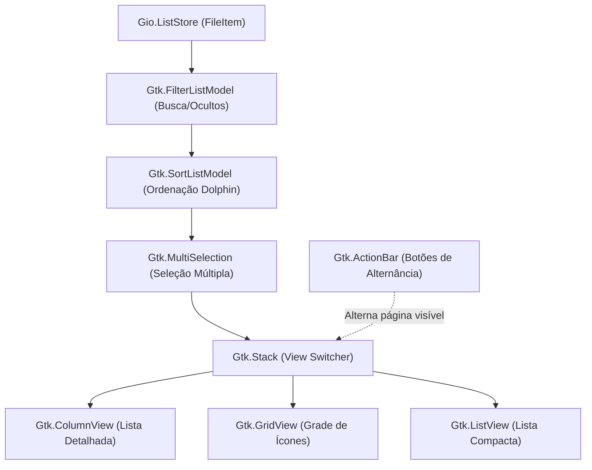

# Proposta de Implementação: Modos de Visualização no Gerenciador de Arquivos do OnyxSH

Documento de especificação técnica e análise de viabilidade para introdução de múltiplos modos de exibição (**Lista Detalhada**, **Grade de Ícones / Grid** e **Lista Compacta**) no gerenciador de arquivos integrado do OnyxSH.

---

## 📌 1. Visão Geral e Veredito Técnico

- **Status:** Proposta Aprovada para Implementação.
- **Viabilidade:** **100% Compatível e Altamente Viável**.
- **Fundamento Arquitetural:** O OnyxSH adota o framework **GTK 4** e **Libadwaita**, no qual os modelos de dados (`Gio.ListStore`, `Gtk.FilterListModel`, `Gtk.SortListModel`, `Gtk.MultiSelection`) são totalmente desacoplados da camada de apresentação (`Gtk.ColumnView`, `Gtk.GridView`, `Gtk.ListView`).
- **Impacto no Backend:** **Zero retrabalho no backend.** Todas as rotinas de `FileOperations` (local e SSH), `TransferManager`, comandos de busca recursiva, pré-visualização Quick Look e diagnósticos por IA funcionam diretamente sobre instâncias de `FileItem`, independentemente de qual widget visual está ativo no momento.

---

## 🏗️ 2. Arquitetura de Apresentação Multiview

### 2.1. Fluxo de Dados e Camada de Apresentação


### 2.2. Comparativo entre os Modos de Visualização

| Modo | Widget GTK 4 | Layout e Elementos Visuais | Casos de Uso Recomendados |
|---|---|---|---|
| **Lista Detalhada** *(Padrão Atual)* | `Gtk.ColumnView` | Tabela tabular multi-colunas: Nome, Tamanho, Data de Modificação, Permissões POSIX, Dono e Grupo. Ordenação por clique no cabeçalho. | Servidores remotos, tarefas de administração de sistemas (SysAdmin), auditoria de permissões e DevOps. |
| **Grade de Ícones (Grid)** | `Gtk.GridView` | Cards verticais responsivos com ícones destacados (48px / 64px), badges coloridos de tipo de arquivo (PY, SH, DOCKER, LOG, JSON, YAML) e nome centralizado. | Navegação rápida em pastas de código, assets visuais, diretórios de fotos, mídias e projetos. |
| **Lista Compacta** | `Gtk.ListView` | Lista vertical simplificada com ícone pequeno (16px) + Nome + Tamanho em linha única. | Painéis laterais estreitos, modo dividido (*split-screen*) ou telas menores. |

---

## 🎨 3. Especificação de Interface e Experiência do Usuário (UX/UI)

### 3.1. Barra de Ações do Gerenciador (`Gtk.ActionBar`)
Inclusão de um seletor de visualização com botões interligados (*linked button group*):

```text
[ ⟳ ] [ 👁 ] [ ★ ] [ 📁 Popover ]  /home/user/project   [ 𝌀 Lista | ⊞ Ícones | ☰ Compacto ]  [ 🔍 Filtrar... ] [ Recursive ( ) ]
```

- **Ícones Padrão Libadwaita:**
  - Lista Detalhada: `view-list-symbolic`
  - Grade de Ícones: `view-grid-symbolic`
  - Lista Compacta: `view-compact-symbolic`

### 3.2. Estrutura do Card no Modo Grade (`Gtk.GridView`)
```text
┌──────────────────────────────┐
│                              │
│            [ 🐍 ]            │  <- Ícone Themed / ThemedIcon (48x48px)
│                              │
│         [ PY Badge ]         │  <- Badge colorido de tipo de script
│        app_service.py        │  <- Nome do arquivo (quebra inteligente em 2 linhas)
│            12.4 KB           │  <- Tamanho formatado (classe CSS .dim-label .caption)
│                              │
└──────────────────────────────┘
```

### 3.3. Menu de Ordenação para Modo Grade
Como o `Gtk.GridView` não possui cabeçalhos tabulares para clique, adiciona-se um menu suspenso ou popover de ordenação com as opções:
- **Nome** (A-Z / Z-A)
- **Tamanho** (Menor-Maior / Maior-Menor)
- **Data de Modificação** (Mais Recente / Mais Antigo)
- **Tipo de Arquivo / Extensão**

---

## ⚙️ 4. Detalhes de Implementação no Código

### 4.1. `src/onyxsh/filemanager/manager.py`
1. **Estrutura de Visualização com `Gtk.Stack`:**
   - Criar `self.view_stack = Gtk.Stack()` dentro de `self.scrolled_window`.
   - Adicionar `self.column_view` como página `"list"`.
   - Adicionar `self.grid_view` como página `"grid"`.
   - Adicionar `self.compact_view` como página `"compact"`.
2. **Criação da Grade (`_create_icon_grid_view`):**
   - Instanciar `Gtk.GridView()`.
   - Criar `Gtk.SignalListItemFactory()` conectando aos métodos `_setup_grid_item`, `_bind_grid_item` e `_unbind_grid_item`.
   - Conectar o modelo `self.selection_model` diretamente ao `GridView`.
   - Conectar o evento de ativação: `self.grid_view.connect("activate", self._on_row_activated)`.
3. **Gestos e Ações:**
   - Reutilizar `_on_item_right_click` para o menu de contexto no botão direito.
   - Reutilizar controladores de teclado para Quick Look (Espaço), F2 (Renomear), Delete (Remover).

### 4.2. `src/onyxsh/settings/manager.py`
- Adicionar chave de configuração padrão:
  ```python
  "file_manager_view_mode": "list",  # "list", "grid", "compact"
  ```
- Salvar a preferência automaticamente sempre que o usuário alternar o modo, garantindo persistência entre reinicializações e novas abas.

---

## 🚀 5. Performance e Benefícios Técnicos

1. **Virtual Scrolling Nativo:**
   - O `Gtk.GridView` renderiza apenas os itens visíveis no viewport da tela (ex: ~30 cards de cada vez), independentemente da pasta conter 50 ou 20.000 arquivos.
2. **Economia de Recursos em Sessões SSH:**
   - Não requer chamadas remotas adicionais: todos os dados já são encapsulados no array existente de `FileItem`.
3. **Fluidez e Elegância GNOME/Adwaita:**
   - Alinhamento total com as Human Interface Guidelines (HIG) do GNOME.

---

## 🧪 6. Plano de Testes Unitários e Validação

1. **Testes de Comutação de Modos:**
   - Validar que a troca de páginas no `Gtk.Stack` atualiza o estado do `SettingsManager`.
2. **Testes de Integridade de Seleção:**
   - Validar que a seleção de itens via teclado e mouse sincroniza entre os modos de exibição sem perda de contexto.
3. **Testes de Ativação e Ações de Contexto:**
   - Validar que `_on_row_activated` abre diretórios e executa arquivos corretamente no modo `GridView`.
