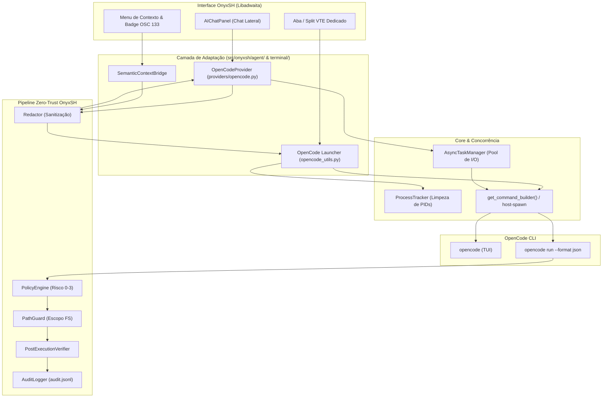

# 📑 Plano de Viabilidade Técnica e Especificação de Integração: OpenCode CLI no OnyxSH

> **Documento:** Especificação Técnica de Integração e Plano de Viabilidade  
> **Componente Alvo:** OpenCode CLI (AI Coding Agent / TUI & Headless)  
> **Sistema Anfitrião:** OnyxSH (`io.github.vagnarok.OnyxSH` v0.13.0 - GTK4 / Libadwaita)  
> **Documento de Referência Arquitetural:** [`ARCHITECTURE.md`](file:///home/vagnarok/OnyxSH/ARCHITECTURE.md)  
> **Data:** Setembro de 2026 | **Classificação:** Especificação Técnica Aprovada para Implementação  

---

## 1. Sumário Executivo & Veredito

| Métrica | Avaliação |
| :--- | :--- |
| **Veredito de Viabilidade** | 🟢 **Altamente Viável, Seguro e Estratégico** |
| **Complexidade Técnica** | 🟡 **Média-Alta** (4 fases desacopladas com esteira rigorosa de testes e Zero-Trust) |
| **Impacto no Usuário** | 🚀 **Muito Alto** (Refatoração multi-arquivo, raciocínio de repositório, suporte a MCP e assistente TUI dedicado) |
| **Risco de Regressão** | 🟢 **Zero Regressão** (Módulos desacoplados, cobertura 100% de testes unitários e respeito aos provedores Gemini/Groq/Ollama) |
| **Esforço Estimado** | ⏱️ **9 a 12 dias de desenvolvimento** (incluindo Fase 0 de infraestrutura e suítes completas de testes) |

### Por que esta integração faz sentido para o OnyxSH?
O **OnyxSH** conta com um ecossistema nativo de excelência para diagnósticos pontuais no shell, realce de sintaxe em tempo real, geração de comandos e execução controlada com salvaguardas de produção ([`TerminalAiAssistant`](file:///home/vagnarok/OnyxSH/src/onyxsh/terminal/ai_assistant.py), [`SemanticTracker`](file:///home/vagnarok/OnyxSH/src/onyxsh/terminal/semantic_tracker.py) e [`AgentOrchestrator`](file:///home/vagnarok/OnyxSH/src/onyxsh/agent/orchestrator.py)).

Contudo, para **engenharia de software e codificação em larga escala** (varredura profunda de repositórios, edição cirúrgica em múltiplos arquivos simultâneos, resolução de dependências e protocolos de ferramentas como o Model Context Protocol - MCP), o **OpenCode CLI** atua de forma especializada.

Integrar o OpenCode ao OnyxSH consolida a melhor solução de terminal para desenvolvedores:
1. O **OnyxSH** fornece a interface Libadwaita moderna, abas/splits VTE acelerados por hardware, isolamento de processos, pipeline Zero-Trust ([`Redactor`](file:///home/vagnarok/OnyxSH/src/onyxsh/agent/redactor.py), [`PathGuard`](file:///home/vagnarok/OnyxSH/src/onyxsh/agent/path_guard.py), [`AuditLogger`](file:///home/vagnarok/OnyxSH/src/onyxsh/agent/audit.py)) e proteção contra desastres com [`ProductionGuard`](file:///home/vagnarok/OnyxSH/src/onyxsh/terminal/production_guard.py).
2. O **OpenCode** assume a responsabilidade de agente autônomo de código de repositório, gerando planos e diffs estruturados.

---

## 2. Diagnóstico da Arquitetura Atual e Reuso de Componentes

Para evitar redundâncias e manter a coesão arquitetural do projeto, a implementação DEVE reutilizar estritamente os componentes consolidados documentados no [`ARCHITECTURE.md`](file:///home/vagnarok/OnyxSH/ARCHITECTURE.md):

1. **Bypass e Consciência de Sandbox Flatpak:**  
   Proibida a invocação manual e despadronizada de subprocessos. Reutilizar [`is_flatpak_sandbox()`](file:///home/vagnarok/OnyxSH/src/onyxsh/utils/platform.py) e `get_command_builder()` de [`src/onyxsh/terminal/spawner.py`](file:///home/vagnarok/OnyxSH/src/onyxsh/terminal/spawner.py) para resolver automaticamente o prefixo `host-spawn` ou `flatpak-spawn --host`.
2. **Gerenciamento de Ciclo de Vida de Processos (`ProcessTracker`):**  
   Instâncias do OpenCode disparadas em abas, splits ou subprocessos headless DEVEM ser registradas em [`ProcessTracker`](file:///home/vagnarok/OnyxSH/src/onyxsh/terminal/spawner.py), garantindo encerramento correto e limpeza de PIDs no fechamento de abas.
3. **Sincronização de Diretório de Trabalho (OSC 7):**  
   A herança do `$PWD` corrente do terminal ativo DEVE ser obtida via [`OSC7Tracker`](file:///home/vagnarok/OnyxSH/src/onyxsh/utils/osc7_tracker.py), garantindo que o OpenCode inicie exatamente na pasta do projeto ativo.
4. **Concorrência e Desacoplamento da UI:**  
   Invocrações headless do OpenCode DEVEM ser submetidas ao Pool de I/O (20 workers) do [`AsyncTaskManager`](file:///home/vagnarok/OnyxSH/src/onyxsh/core/tasks.py), impedindo qualquer bloqueio da thread principal do GTK4.
5. **Pipeline de Segurança Zero-Trust:**  
   Todo payload de entrada e saída transacionado pelo OpenCode DEVE atravessar [`Redactor`](file:///home/vagnarok/OnyxSH/src/onyxsh/agent/redactor.py), [`PathGuard`](file:///home/vagnarok/OnyxSH/src/onyxsh/agent/path_guard.py), [`PolicyEngine`](file:///home/vagnarok/OnyxSH/src/onyxsh/agent/policy_engine.py), [`PostExecutionVerifier`](file:///home/vagnarok/OnyxSH/src/onyxsh/agent/verifier.py) e [`AuditLogger`](file:///home/vagnarok/OnyxSH/src/onyxsh/agent/audit.py).

---

## 3. O que é o OpenCode CLI e seus Modos de Operação

O **OpenCode** oferece 3 modalidades principais de operação que se encaixam na arquitetura do OnyxSH:

1. **Modo TUI Interativo (`opencode`):**  
   Interface de terminal completa para refatoração e diálogos com visualização de diffs em texto. Ideal para abas e divisões de tela dedicadas no terminal.
2. **Modo Headless / Automação (`opencode run`):**  
   Invocação sem interface gráfica via CLI:  
   `opencode run "tarefa" --format json --file "<caminho>"`  
   Suporta `--model <provider/model>`, `--session <id>`, `--continue` e conexões com servidores MCP. Retorna saída estritamente estruturada em JSON.
3. **Modo Servidor / Daemon (`opencode serve`):**  
   Daemon local HTTP/JSON-RPC com gerenciamento de sessões contínuas e memória persistente de projeto.

---

## 4. Modelos de Integração Propostos



---

### 🔹 Abordagem 1: "Aba / Split Dedicado OpenCode" (Launcher TUI)
- **Como funciona:**
  - O usuário aciona o atalho global `Ctrl + Shift + O`, o item na **Command Palette** (`Ctrl + Shift + P ➔ "OpenCode: Abrir Assistente de Código"`) ou o botão na HeaderBar.
  - O OnyxSH abre um split vertical ou nova aba instanciando `opencode` diretamente no `$PWD` da sessão ativa.
- **Requisitos Técnicos Obrigatórios:**
  1. **Detecção Host/Flatpak:** REUTILIZAR `get_command_builder()` de [`src/onyxsh/terminal/spawner.py`](file:///home/vagnarok/OnyxSH/src/onyxsh/terminal/spawner.py) para construir os argumentos de invocação (`host-spawn opencode` ou execução nativa).
  2. **Rastreamento de Processo:** REGISTRAR o PID da sessão criada no [`ProcessTracker`](file:///home/vagnarok/OnyxSH/src/onyxsh/terminal/spawner.py) para garantir encerramento gracioso com envio de `SIGTERM` e destruição de arquivos temporários quando a aba for fechada.
  3. **Preservação de Diretório:** Obter o `$PWD` através do [`OSC7Tracker`](file:///home/vagnarok/OnyxSH/src/onyxsh/utils/osc7_tracker.py) em vez de caminhos estáticos ou parsing de strings frágeis.
  4. **Multi-Instância Resiliente:** Suportar múltiplas instâncias concorrentes do OpenCode (uma por aba/split) isolando diretórios de runtime e identificadores de sessão.

---

### 🔹 Abordagem 2: "OpenCode como Provedor Headless no Chat Lateral" (Integração Profunda)
- **Como funciona:**
  - O **OpenCode** passa a figurar como um provedor de IA selecionável no seletor de modelos da barra lateral ([`AIChatPanel`](file:///home/vagnarok/OnyxSH/src/onyxsh/ui/widgets/ai_chat_panel.py)).
  - Implementação da classe `OpenCodeProvider` em `src/onyxsh/agent/providers/opencode.py` herdando de `LLMProvider`.
  - Execução em background via CLI headless:
    ```bash
    opencode run --format json --file "<caminho>" "<prompt_sanitizado>"
    ```

#### Especificação de Concorrência e Resiliência
- **Worker Pool:** O despacho do subprocesso DEVE ocorrer exclusivamente no Pool de I/O do [`AsyncTaskManager`](file:///home/vagnarok/OnyxSH/src/onyxsh/core/tasks.py) (20 workers). Proibido invocar `subprocess.run` na thread do GTK4.
- **Timeout Padrão:** 120 segundos (configurável em `settings.json` na chave `opencode.timeout_seconds`).
- **Cancelamento Ativo:** O cancelamento pelo usuário via UI aciona `future.cancel()` e envia `SIGTERM` (seguido de `SIGKILL` após grace period de 3s) ao processo subjacente.

#### Especificação do Mapeamento de Dados (OpenCode JSON ➔ ActionPlan)
A resposta JSON estruturada retornada pelo OpenCode DEVE ser validada e convertida para as dataclasses canônicas de [`src/onyxsh/agent/models.py`](file:///home/vagnarok/OnyxSH/src/onyxsh/agent/models.py):

| Campo OpenCode JSON | Campo OnyxSH (`ActionStep`) | Tratamento e Validação Obrigatória |
| :--- | :--- | :--- |
| `files[].path` | `ActionStep.target_path` | Validação estrita via [`PathGuard`](file:///home/vagnarok/OnyxSH/src/onyxsh/agent/path_guard.py) (bloquear `~/.ssh`, `~/.bashrc`, etc.) |
| `files[].diff` | `ActionStep.diff_content` | Renderização nativa com sintaxe colorida em [`DiffReviewDialog`](file:///home/vagnarok/OnyxSH/src/onyxsh/ui/dialogs/diff_review_dialog.py) |
| `risk_level` | `ActionPlan.risk_level` | Mapeamento para o enum `RiskLevel` (0=READ_ONLY, 1=USER_WRITE, 2=SYSTEM_MODIFY, 3=ADMIN) |
| `commands[]` | `ActionStep.argv` / `command` | Validação estrita contra `deny_patterns.json` via [`PolicyEngine`](file:///home/vagnarok/OnyxSH/src/onyxsh/agent/policy_engine.py) |
| `explanation` | `ActionPlan.summary` | Apresentado no cabeçalho do cartão de ação no chat |

---

### 🔹 Abordagem 3: "Ações Contextuais de Terminal ➔ OpenCode" (Atalhos de Produtividade)
- **Menu de Contexto:** Clique com botão direito em seleção de texto no terminal exibe: *"Refatorar seleção com OpenCode"*.
- **Badge OSC 133:** Se um comando falhar com código diferente de zero (`exit_code != 0`), o terminal exibe o botão rápido `[ Resolver Projeto com OpenCode ]`.

#### Pipeline de Contexto Obrigatório:
1. Extração cirúrgica da saída do comando falho via [`SemanticTracker`](file:///home/vagnarok/OnyxSH/src/onyxsh/terminal/semantic_tracker.py) utilizando os marcadores semânticos OSC 133.
2. Sanitização obrigatória de chaves de API, senhas e tokens via [`Redactor`](file:///home/vagnarok/OnyxSH/src/onyxsh/agent/redactor.py).
3. Encapsulamento de dados brutos e não confiáveis na tag `<untrusted>...</untrusted>` conforme diretrizes de segurança do [`ARCHITECTURE.md`](file:///home/vagnarok/OnyxSH/ARCHITECTURE.md#6-diretrizes-de-segurança-para-agentes-de-ia).
4. Registro de auditoria no [`AuditLogger`](file:///home/vagnarok/OnyxSH/src/onyxsh/agent/audit.py).

---

## 5. Matriz de Segurança e Regras do OnyxSH

| Vetor / Componente | Desafio Técnico | Solução Obrigatória no OnyxSH |
| :--- | :--- | :--- |
| **`Redactor`** | Logs de terminal ou contexto de erro podem conter tokens, chaves SSH ou senhas. | Aplicar [`Redactor`](file:///home/vagnarok/OnyxSH/src/onyxsh/agent/redactor.py) em todo o payload antes do envio ao OpenCode. |
| **`AuditLogger`** | Alterações multi-arquivo não podem ser aplicadas de forma opaca ou irreversível. | Registrar cada `ActionStep` em `audit.jsonl` com backup prévio de arquivos para permitir rollback atômico. |
| **`PostExecutionVerifier`** | O OpenCode pode reportar sucesso sem que a alteração tenha surtido efeito real no disco. | Disparar verificações pós-execução via [`PostExecutionVerifier`](file:///home/vagnarok/OnyxSH/src/onyxsh/agent/verifier.py) (presença de arquivo, sintaxe, etc.). |
| **`PathGuard`** | Risco de sobrescrever arquivos de configuração críticos (`~/.ssh`, `~/.bashrc`, `/etc/`). | Validar cada path retornado pelo OpenCode contra a denylist do [`PathGuard`](file:///home/vagnarok/OnyxSH/src/onyxsh/agent/path_guard.py). |
| **`ProductionGuard`** | Execução de comandos destrutivos em terminais de servidores de produção. | Se `is_production == True`, chamadas headless são bloqueadas e exigem confirmação via `ProductionConfirmDialog`. |
| **Anti-Prompt Injection** | Saídas maliciosas de scripts de terceiros contendo instruções de evasão. | Envolver todo conteúdo de terminal capturado em tags `<untrusted>...</untrusted>`. |
| **Modo Offline** | Políticas de privacidade corporativa impedindo tráfego para APIs públicas. | Se `offline_mode == True`, o OpenCode deve ser forçado a usar endpoints locais (Ollama / LocalAI). |
| **Segurança MCP** | Ferramentas e servidores MCP externos podem solicitar acessos perigosos. | Validar acessos a ferramentas MCP via `PathGuard` e exigir aprovação explícita do usuário no primeiro uso. |

---

## 6. Cronograma e Esforço Estimado Revisado

O cronograma revisado reflete o compromisso com testes automatizados, tratamento de erros e integração profunda com a segurança do sistema:

```
[ Fase 0: Utilitários Base, Detecção e Testes ] ──▶ ~1 a 2 dias  (Fundação)
[ Fase 1: Launcher TUI & Command Palette ]       ──▶ ~2 a 3 dias  (Baixo Risco)
[ Fase 2: Provedor Headless & Pipeline Seguro ]  ──▶ ~4 a 5 dias  (Médio Risco)
[ Fase 3: Ações de Contexto & Integração OSC ]   ──▶ ~2 a 3 dias  (Baixo Risco)
──────────────────────────────────────────────────────────────────────────────
Esforço Total Estimado: ~9 a 12 dias úteis
```

---

## 7. Próximos Passos Recomendados

1. **Aprovação da Especificação Técnica:** Consolidar este documento como guia definitivo de engenharia para o OpenCode.
2. **Início pela Fase 0:** Implementar `src/onyxsh/utils/opencode_utils.py` com detecção de binário, suporte a sandbox Flatpak e a suíte `tests/test_opencode_utils.py`.
3. **Validação Contínua com a Suíte Global:** Manter 100% de aprovação nos 508 testes existentes durante todas as fases.

---

## 8. Estratégia de Testes Automatizados

Em estrita conformidade com a Seção 7 do [`ARCHITECTURE.md`](file:///home/vagnarok/OnyxSH/ARCHITECTURE.md#7-guia-de-desenvolvimento-e-testes-automatizados) e o [`AGENTS.md`](file:///home/vagnarok/OnyxSH/AGENTS.md), toda e qualquer implementação do OpenCode DEVE ser acompanhada de testes unitários automatizados.

### 8.1. Estrutura de Testes por Fase

- **Fase 0 (Utilitários e Detecção):**  
  - [`tests/test_opencode_utils.py`](file:///home/vagnarok/OnyxSH/tests/test_opencode_utils.py): Testes de detecção de binário no host (`shutil.which`), resolução de wrapper Flatpak via `get_command_builder()`, validação de versão mínima e cache em memória.
- **Fase 1 (Launcher TUI e Abas/Splits):**  
  - [`tests/test_opencode_launcher.py`](file:///home/vagnarok/OnyxSH/tests/test_opencode_launcher.py): Construção correta dos argumentos de comando, injeção de `$PWD` via OSC 7, registro de PID em `ProcessTracker` e suporte a múltiplos splits simultâneos.
- **Fase 2 (Provedor Headless e Pipeline Zero-Trust):**  
  - [`tests/test_opencode_provider.py`](file:///home/vagnarok/OnyxSH/tests/test_opencode_provider.py): Parsing do JSON retornado pelo OpenCode, conversão precisa para `ActionPlan`/`ActionStep`, tratamento de timeout (120s) e cancelamento gracioso via SIGTERM.
  - [`tests/test_opencode_security.py`](file:///home/vagnarok/OnyxSH/tests/test_opencode_security.py): Interceptação de caminhos proibidos por `PathGuard`, classificação de risco por `PolicyEngine`, sanitização de chaves por `Redactor` e gravação de logs em `AuditLogger`.
- **Fase 3 (Ações Contextuais de Terminal):**  
  - [`tests/test_opencode_context.py`](file:///home/vagnarok/OnyxSH/tests/test_opencode_context.py): Captura de saídas de erro via marcadores OSC 133, envolvimento em tags `<untrusted>`, disparo de menu de contexto e validação do badge de erro.

### 8.2. Regra Mandatória de Execução
Antes de cada commit ou entrega, a suíte de testes completa DEVE ser executada e obter 100% de sucesso:
```bash
PYTHONPATH=src python3 -m unittest discover -s tests
```

---

## 9. Tratamento de Erros e Resiliência

| Cenário de Falha | Comportamento Esperado do OnyxSH |
| :--- | :--- |
| **Binário não encontrado** | Exibir banner informativo não intrusivo com botão "Copiar comando de instalação" (`curl -fsSL https://opencode.ai/install \| bash`). |
| **Versão incompatível** | Informar a versão mínima necessária e orientar atualização com link de documentação. |
| **Timeout na execução headless** | Enviar `SIGTERM` ao processo do OpenCode; se persistir por mais de 3s, enviar `SIGKILL`. Notificar usuário via Toast e registrar no `LoggerManager`. |
| **JSON malformado ou truncado** | Registrar payload bruto em log de erro (com redação de dados sensíveis), notificar o usuário de forma amigável e oferecer opção de abrir a tarefa no modo interativo (TUI). |
| **Processo zumbi ou orfão** | O `ProcessTracker` monitora o ciclo de vida e garante limpeza forçada de PIDs no descarte do widget de terminal. |
| **Conflito de sessão concorrente** | Gerar identificador UUID único para cada execução headless; nunca reaproveitar sessões ativas sem consentimento explícito. |

---

## 10. Configurações e Persistência

### 10.1. Novas Chaves de Configuração (`settings.json`)
Integradas ao [`SettingsManager`](file:///home/vagnarok/OnyxSH/src/onyxsh/settings/manager.py):
- `opencode.enabled` (*bool*, default: `True`): Habilita/desabilita as integrações com OpenCode no sistema.
- `opencode.binary_path` (*string*, default: `""`): Caminho personalizado para o binário (vazio = auto-detecção).
- `opencode.default_model` (*string*, default: `""`): Modelo padrão passado via `--model` em execuções headless.
- `opencode.timeout_seconds` (*int*, default: `120`): Tempo limite para respostas do modo headless antes de abortar.
- `opencode.offline_provider` (*string*, default: `"ollama"`): Provedor local forçado quando em Modo Offline.

### 10.2. Persistência de Sessões (`opencode_sessions.json`)
Arquivo de estado em `~/.config/onyxsh/opencode_sessions.json`:
- Armazena `session_id`, `working_directory`, modelo utilizado, data de criação e timestamp de última interação.
- Integrado com [`window_state.py`](file:///home/vagnarok/OnyxSH/src/onyxsh/state/window_state.py) para restaurar abas do OpenCode ao reabrir a janela principal.
- Política de expiração automática para sessões inativas há mais de 30 dias.

### 10.3. Reatividade com GObject
Alterações nas preferências do OpenCode disparam sinais de notificação no `SettingsManager`, atualizando a interface gráfica imediatamente sem exigir reinício da aplicação.

---

## 11. Modo Offline e Privacidade

Quando o Modo Offline for ativado no OnyxSH (`offline_mode = True`):
1. **Bloqueio de Redes Externas:** O provedor `OpenCodeProvider` proíbe o envio de requisições para LLMs remotos na nuvem.
2. **Forçamento de Modelos Locais:** Injeta obrigatoriamente flags para apontar para endpoints locais do Ollama ou LocalAI (`--model ollama/...`).
3. **Defesa em Profundidade:** O [`Redactor`](file:///home/vagnarok/OnyxSH/src/onyxsh/agent/redactor.py) permanece ativo mesmo em modo offline para evitar contaminação de bases locais com segredos corporativos.
4. **Auditoria de Conformidade:** O [`AuditLogger`](file:///home/vagnarok/OnyxSH/src/onyxsh/agent/audit.py) anota a flag `offline: true` em todos os registros de execução.

---

## 12. Observabilidade e Logging

- **Canal de Log Dedicado:** Todas as operações do OpenCode são registradas sob o canal nomeado `"onyxsh.agent.opencode"` através do [`LoggerManager`](file:///home/vagnarok/OnyxSH/src/onyxsh/utils/logger.py).
- **Métricas de Performance:** Medição do tempo de resposta (latência de execução headless) registrada para fins de diagnóstico.
- **Registro de Alertas:** Erros de parsing, chamadas bloqueadas por `PathGuard` e timeouts geram entradas categorizadas em `WARNING` ou `ERROR`.
- **Monitoramento de Recursos:** O consumo de CPU e memória do processo do OpenCode é contabilizado e visualizável no painel de recursos da janela principal.

---

## 13. Integração com MCP (Model Context Protocol)

O OpenCode suporta o ecossistema de ferramentas MCP. O OnyxSH estabelece as seguintes diretrizes de segurança:

1. **Descoberta Controlada:** Servidores e ferramentas MCP configurados no OpenCode são detectados e exibidos na interface do painel lateral.
2. **Inspeção de Acesso pelo PathGuard:** Qualquer ferramenta MCP invocada que execute leitura ou escrita em arquivos do sistema DEVE submeter os caminhos alvo à validação do [`PathGuard`](file:///home/vagnarok/OnyxSH/src/onyxsh/agent/path_guard.py).
3. **Classificação de Risco Automática:**  
   - Ferramentas MCP de leitura de arquivos: `RiskLevel.READ_ONLY`.  
   - Ferramentas MCP de modificação de código/arquivos: `RiskLevel.USER_WRITE` (exigem exibição de diff).  
   - Ferramentas MCP de rede ou comandos de sistema: `RiskLevel.SYSTEM_MODIFY`.  
4. **Consentimento Explícito do Usuário:** O primeiro acionamento de qualquer ferramenta MCP de terceiros exige confirmação via diálogo modal de autorização.

---

## 14. Critérios de Aceite (Definition of Done)

### ✅ Fase 0: Utilitários e Infraestrutura Base
- [ ] Módulo `src/onyxsh/utils/opencode_utils.py` implementado.
- [ ] Detecção de binário funcional tanto em ambiente nativo quanto sob Flatpak via `get_command_builder()`.
- [ ] Suíte de testes `tests/test_opencode_utils.py` cobrindo 100% dos métodos de detecção e cache.
- [ ] Todos os 508 testes da suíte global passando sem regressões.

### ✅ Fase 1: Launcher TUI em Abas e Splits
- [ ] Atalho `Ctrl + Shift + O` abre split vertical ou nova aba com OpenCode.
- [ ] Ação integrada na Command Palette (`Ctrl + Shift + P`).
- [ ] Herança fiel do diretório `$PWD` via `OSC7Tracker`.
- [ ] Processo registrado em `ProcessTracker` com limpeza no fechamento da aba.
- [ ] Suíte `tests/test_opencode_launcher.py` validada com 100% de sucesso.

### ✅ Fase 2: Provedor Headless e Pipeline Zero-Trust
- [ ] OpenCode listado como provedor no seletor de modelos da barra lateral (`AIChatPanel`).
- [ ] Saída JSON do OpenCode convertida com fidelidade para `ActionPlan` e `ActionStep`.
- [ ] Diffs de alteração renderizados nativamente no `DiffReviewDialog`.
- [ ] `PathGuard` bloqueando qualquer tentativa de modificação em caminhos protegidos.
- [ ] `Redactor` mascarando dados sensíveis antes do envio do prompt.
- [ ] `AuditLogger` gravando ações atômicas em `audit.jsonl` com suporte a rollback.
- [ ] Timeouts de 120s e cancelamento assíncrono via `AsyncTaskManager` validados.
- [ ] Suítes `tests/test_opencode_provider.py` e `tests/test_opencode_security.py` passando 100%.

### ✅ Fase 3: Ações Contextuais e Integração com Terminal
- [ ] Menu de contexto do terminal com opção *"Refatorar seleção com OpenCode"*.
- [ ] Badge de erro pós-falha de build (OSC 133) com botão *"Resolver com OpenCode"*.
- [ ] Contexto extraído do terminal encapsulado rigorosamente em tags `<untrusted>`.
- [ ] Suíte de testes `tests/test_opencode_context.py` validada.
- [ ] Suíte global completa de testes passando com 100% de aprovação antes do merge.
